syj_dating3 - Flutter app and spring-cloud micro services
========================================================
# 주요기능
### 로그인
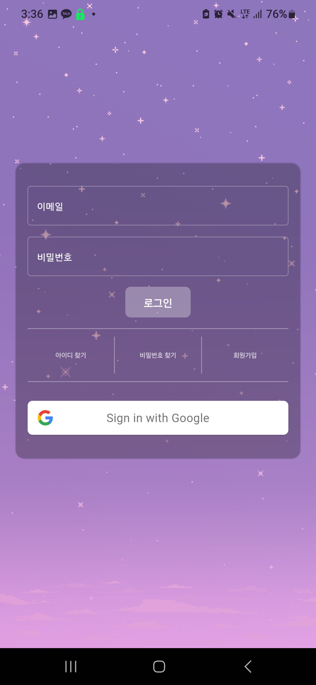

#### 이메일 로그인
* 회원가입시 등록한 이메일과 비밀번호로 로그인합니다. 로그인에 성공하면 JWT토큰을 부여받아 secure_storage에 저장되어 다음에 앱을 켤때 자동으로 로그인 합니다.
#### 구글 로그인
* 구글 계정으로 로그인합니다. 로그인 성공시 Firebase_auth를 통해 ID토큰을 발급받고 이 토큰을 이용해서 로그인합니다. 서버에서 ID토큰이 유효한지 검증하고 새로운 JWT토큰을 부여받습니다.
#### 로그인 이력 저장
* 로그인 시 IP, 기기모델 등 데이터를 서버에 저장합니다.

 

### 회원 가입

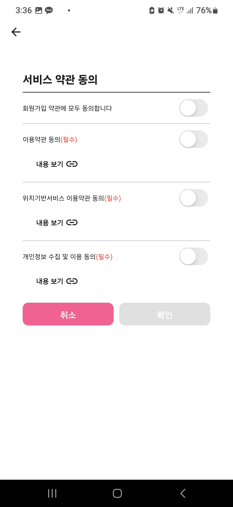

#### 이메일로 프로필 생성하기
* 이메일과 비밀번호를 입력하여 계정을 생성합니다. 비밀번호는 SHA512로 암호화 하여 저장됩니다.
#### 구글계정으로 프로필 생성하기
* 구글 계정으로 로그인하여 회원가입하고 프로필 정보만 작성합니다. 마지막 회원가입 요청시 유효한 ID토큰인지 검증하고 회원가입을 최종처리합니다.

 

### 전화번호 인증

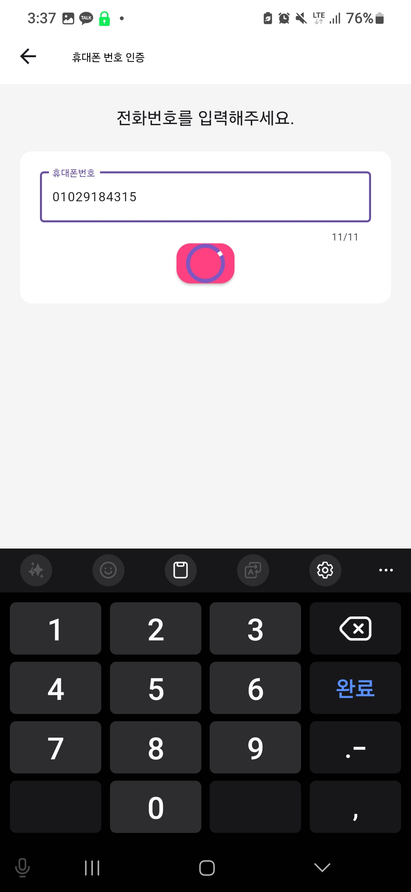
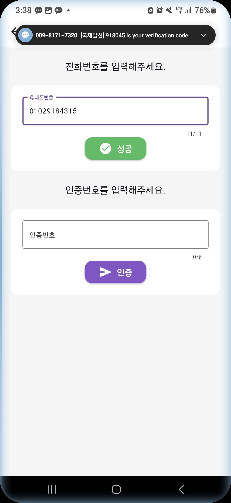

#### 인증코드 받기
* 전화번호를 입력하고 전화번호로 인증번호를 받습니다.
#### 인증코드 검증하기
* 유효한 인증번호일 경우 ID토큰을 부여받습니다. 최종 회원가입 요청시 Id토큰을 검증합니다.

 

### 회원가입 사진등록
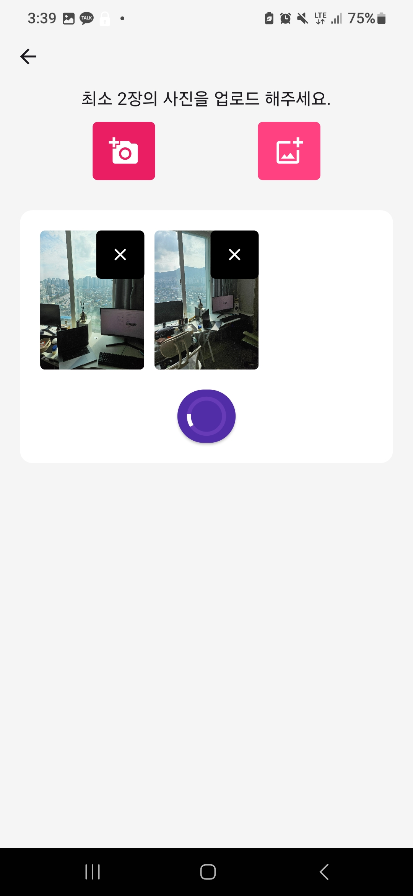
#### 사진 업로드하기
* 카메라및 갤러리에서 사진을 선택하고 업로드합니다.
* 최대 6장까지 업로드 가능합니다.

 

### 내 프로필 설정 및 정보
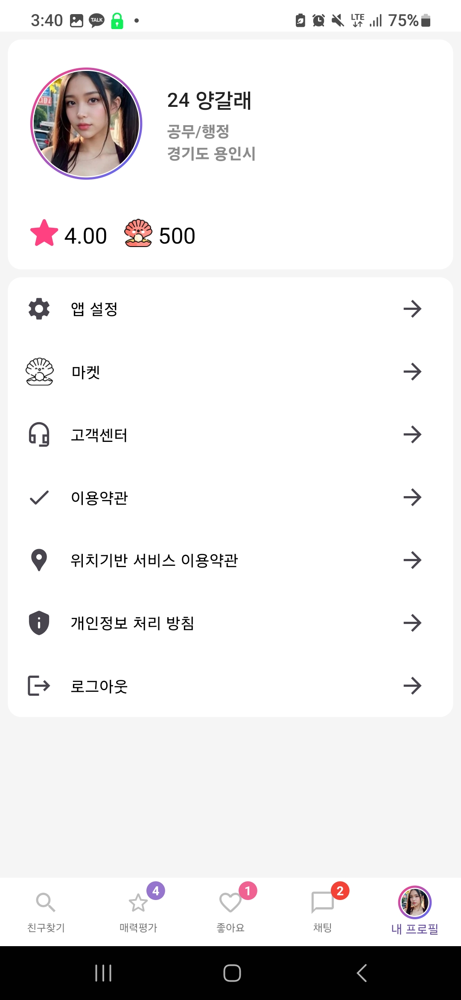
#### 프로필 보기
* 내 프로필을 조회하고 수정합니다.
#### 앱 설정
* 설정 앱으로 이동합니다.
#### 로그아웃
* secure_storage 및 계정 데이터를 모두 지우고 로그인 페이지로 이동합니다.

 

### 프로필 상세

#### 프로필 수정
* 내 프로필을 조회하고 수정합니다.

 

### 내 근처 친구찾기 리스트
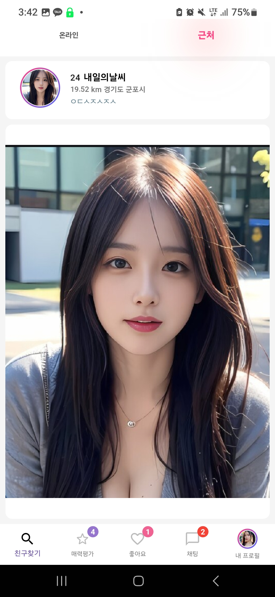
#### 위치 권한 허용 및 내 위치 lat long 가져오기
* 위치 권한을 허용시 앱이 resume될 때 내 기기 위치의 lat long을 측정하고 서버에 저장합니다.
* lat long 값을 기반으로 근처 사용자의 리스트를 보여줍니다.
#### reverse geocoding으로 지역명 표시
* 구글 맵 API를 사용하여 지역명을 표시합니다.
 

### 프로필 선택 및 좋아요 보내기
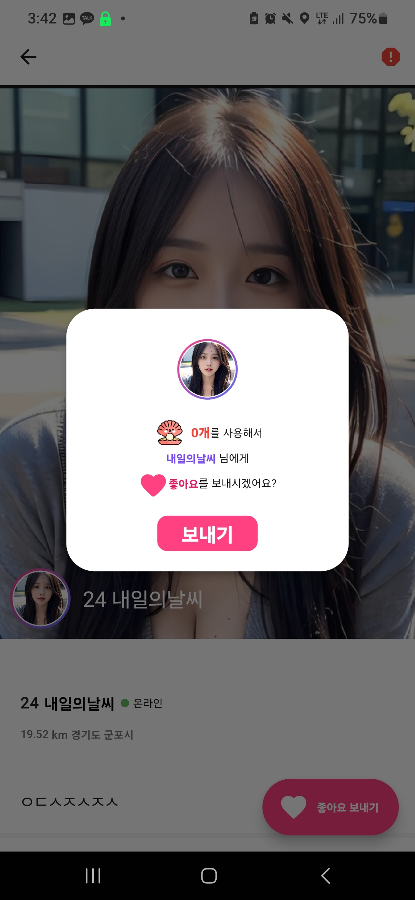
#### 좋아요 보내기
* 받은 좋아요 목록에 없는상대, 현재 채팅중이 아닌 상대, 보낸 좋아요 목록에 없는 상대 조건을 충족한 상대에게 Like를 보낼 수 있습니다.
* socket연결을 통해 실시간으로 좋아요 메세지를 보내며 알림 권한을 허용한 기기에는 FCM을 통해 Notification을 표시합니다.
* 네트워크 오류로 연결이 끊기면 연결을 재시도합니다
 

### 받은 좋아요 리스트
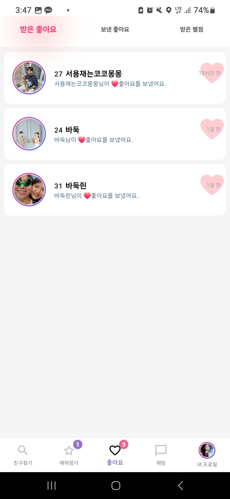
#### 좋아요 메시지 수신
* 포그라운드 상태일때 socket연결을 통해 실시간으로 좋아요 메세지를 받습니다. 백그라운드 상태일때는 socket연결이 끊긴 상태이므로 앱이 resume 되면 DB에서 내역을 불러옵니다.
* FCM을 통해 앱이 백그라운드 및 절전모드에 있어도 좋아요 Notification이 표시됩니다.
 

### 좋아요 받기
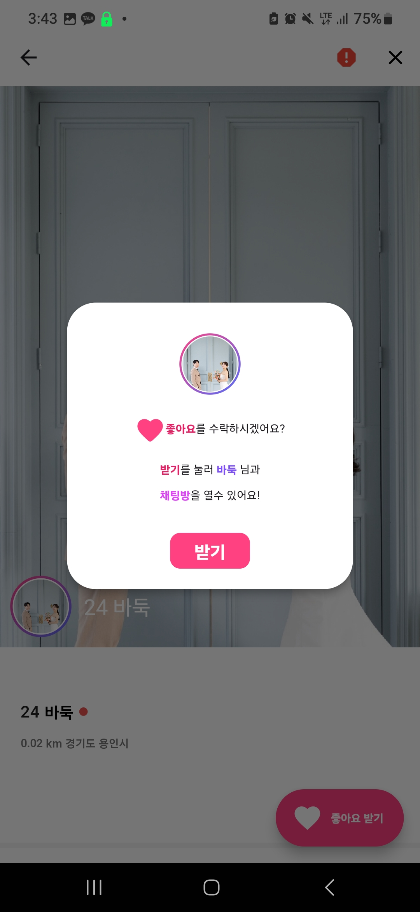
#### 좋아요 받기
* 좋아요를 수락하면 현재 대화중이 아닌 상대일 경우 채팅방을 생성합니다.
 

### 채팅방 리스트와 채팅방 개설
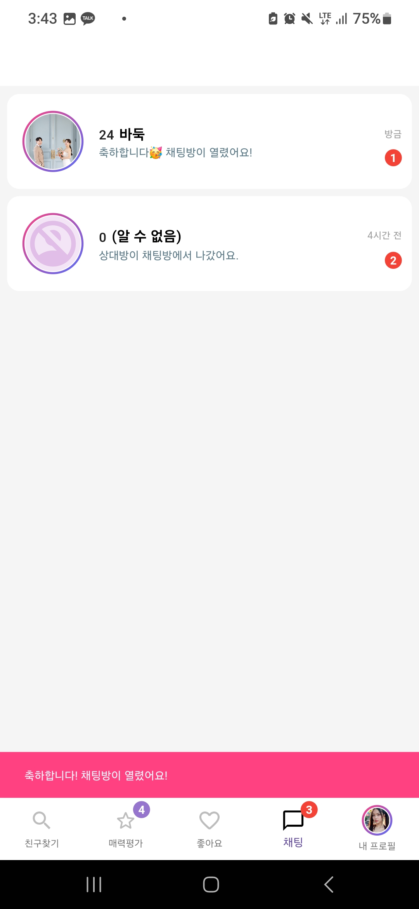
#### 채팅방 생성
* 채팅방 생성시 상대에게 socket 및 fcm을 통해 알림 메세지를 보냅니다.
 

### 친구와 채팅
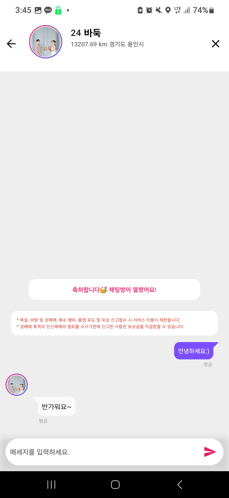
#### 채팅 데이터 송수신 및 이력 저장
* 채팅방 입장시 socket연결을 수립하고 실시간으로 데이터를 송수신 합니다.
* 상대가 앱이 백그라운드 상태이거나 종료 상태일 경우 FCM만 전송되고 채팅 내역은 DB에 저장됩니다.
* 채팅방 입장시 채팅내역을 불러온 후 secure_storage에 저장하고 이후 새로운 채팅 내역을 DB에서 불러올때 secure_storage 저장되지 않은 채팅내역만 불러오게하여 응답속도를 높였습니다.
 

### 채팅방 나가기
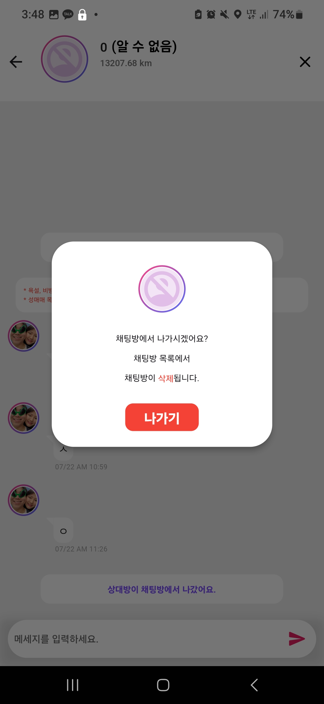
#### 채팅방 나가기 메세지 전송
* 채팅방에서 나가면 socket을 통해 퇴장 메시지를 전송하고 DB에 이력을 저장합니다.
#### 상대방에게 보여지는 프로필 정보 삭제
* 상대방에게 내 프로필을 더이상 표시하지 않습니다.
#### 채팅방 재생성
* 한 번 채팅이 종료된 상대라도 다시 좋아요를 보낼 수 있습니다. 재 생성시 이전 채팅 내역이 복구됩니다.
#### 대화내용 신고
* 상대방이 나가서 프로필이 표시되지 않아도 대화내용을 신고할 수 있습니다.
 

### 매력평가 탭
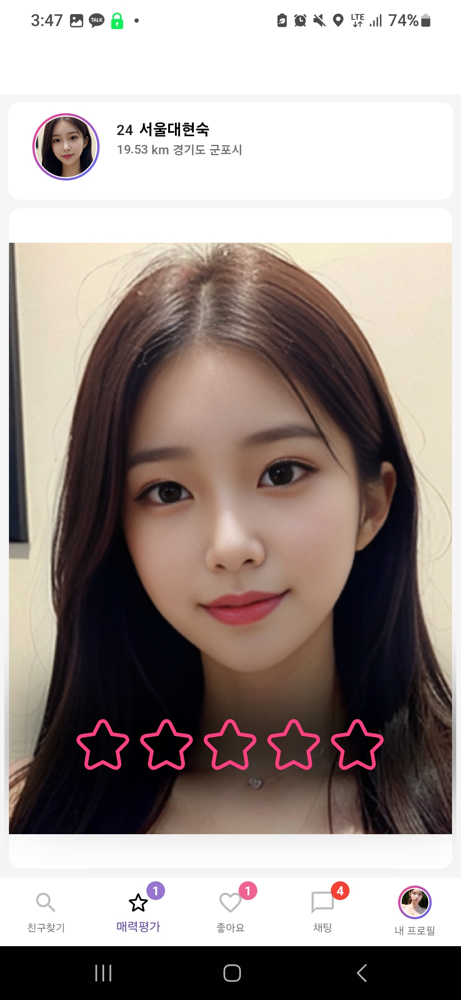
#### 매력평가할 프로필 받기
* 매시 정각에 내가 평가할 프로필이 새롭게 지정됩니다.
#### 매력평가하기
* rating bar 를 터치하여 매력을 평가합니다. socket연결을 통해 데이터를 전송하고 이력을 저장합니다.
* 상대에게 받은 평가는 1주일간 지속됩니다.
#### 매력평가 확인
* 내가 받은 매력평가는 받은별점 탭에서 확인할 수 있습니다.
* 별점 4점 이상을 준 경우 상세 프로필에 표시됩니다.
#### 매력평가 평점 확인
* 내가 받은 매력평가의 평균 값을 내 프로필 탭에서 확인할 수 있습니다.
* 내 매력평가 평점에 따라 추천 프로필 및 매력평가할 프로필 리스트가 달라집니다.

 

### 친구 프로필 상세 페이지에서 매력 평가하기
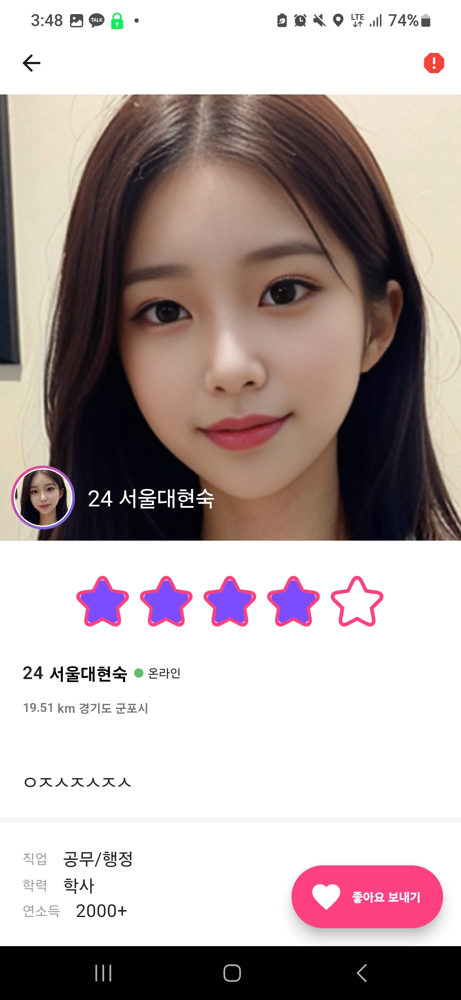
#### 매력평가하기
* rating bar 를 터치하여 매력을 평가합니다. socket연결을 통해 데이터를 전송하고 이력을 저장합니다.
 

### 매력평가할 프로필 대기상태
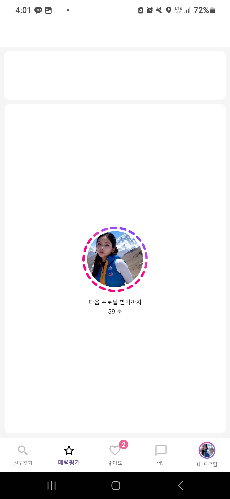
#### 프로필을 모두 평가했을때
* 다음 정시가 될 때까지 남은시간을 표시합니다.
 

### 불량유저 신고하기
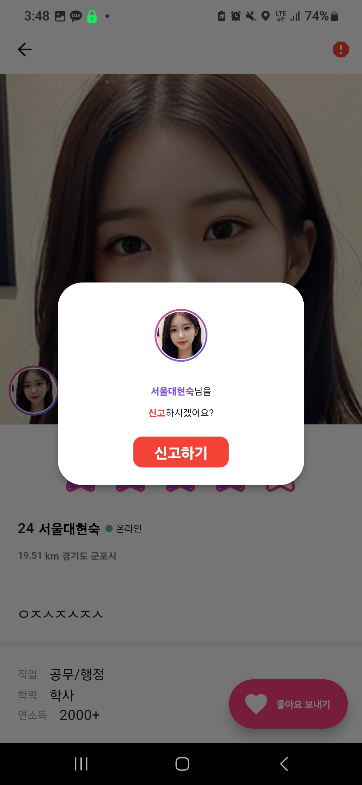
#### 신고 접수
* 신고가 접수 되고 해당 사용자에 서비스를 제한할 수 있습니다.

# 보안성검토
### 악성파일 업로드 및 실행이 불가능하도록 적용되었는가?
#### 화이트리스트 파일 확장자 필터링 등 적용.
#### 파일 저장경로에서 실행 권한 없음.

 

### 파일이 무단으로 다운로드 되지 않도록 적용되었는가?
#### N/A

 

### 파라미터 값을 이용한 변조 공격이 불가능하도록 적용되었는가?
#### 파라미터이 토큰에 포함된 값과 비교하여 일치할 경우만 실행 등 적용.

 

### Injection 공격이 불가능하도록 적용되었는가?
#### 서버에서 특수문자 일부 제외하고 모두 필터링 등 적용.

 

### XSS(Cross Site Scripting) 공격이 불가능하도록 적용되었는가?
#### 입력값 특수문자 일부 제외하고 모두 필터링 등 적용.

 

### 계정발급 절차가 존재하는가?
#### O

 

### 미사용 계정 및 불필요 계정에 대해 주기적으로 폐기되고 있는가?
#### 배치로 휴면계정 전환

 

### 패스워드 생성 및 복구절차가 적용되었는가?
#### 전화번호 인증후 생성 및 변경 가능. 토큰이 유효한지 검증.

 

### 패스워드가 암호화되어 관리되는가?
#### SHA512로 암호화 등 적용.

 

### 패스워드에 대한 변경 정책이 적용되었는가?
#### 전화번호 인증후 생성 및 변경 가능. 토큰이 유효한지 검증.

 

### 서버 접근에 대한 인증이 적용되었는가?
#### 스프링 시큐리티, API Gateway 필터링, 요청시 삽입된 토큰이 유효한지 검증 등 적용.

 

### 관리자페이지가 임의 접근이 불가능하도록 적용되었는가?
#### 관리자 페이지 없음.

 

### 로그인 보안강화 기능이 적용되었는가?
#### 스프링 시큐리티

 

### Replay Attack이 불가능하도록 적용되었는가?
#### N/A

 

### 보안기능(로그인, 체크로직 등)을 우회 불가능하도록 적용되었는가?
#### 토큰 미획득시 API 호출 불가능, API Gateway 필터링 등

 

### 시스템 내 중요정보가 노출되지 않도록 적용되었는가?
#### O

 

### 중요정보 전송시 암호화되어 전송되는가?
#### O

 

### 에러 메시지에서 중요정보가 노출되지 않도록 적용되었는가?
#### O
 
### 디렉토리 리스팅이 불가능하도록 설정되어 있는가?
#### N/A

 

### WAS의 디폴트 패스워드를 변경하였는가?
#### O

 

### 원격에서 소스 생성/수정/삭제가 가능한 서비스를 중지 하였는가?
#### N/A

 

### 개인정보 취급방침, 처리방침 및 약관이 명시되었는가?
#### O

 

### 회원 가입시 만 14세 이상과 미만을 구분하고 있는가?
#### 만 18세 이상 이용가능.

 

### 개인정보 이용에 대해 정보주체(이용자)에게 동의를 받고 있는가?
#### O

 

### 회원정보 조회/수정 시에 재인증을 시행하고 있는가?
#### 전화번호 인증.

 

### 중요 개인정보를 암호화하여 저장하고 있는가?
#### O

 

### 화면에 표시되는 중요 개인정보에 마스킹 처리가 적용되었는가?
#### N/A

 

### 계정 및 패스워드 찾기에 주민번호가 아닌 수단을 사용하고 있는가?
#### 전화번호 인증.

 

### 주민번호를 수집하는 기능이 삭제 되었는가?
#### 주민번호 수집 안함.

  
