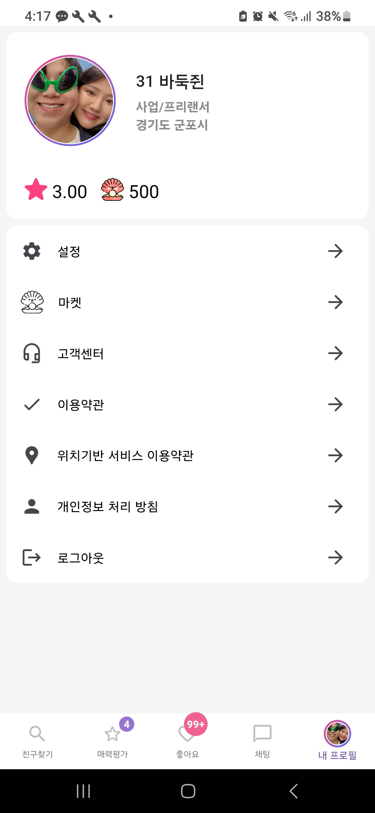

# syj_dating3
Flutter app and spring-cloud msa
주요기능

친구찾기:
  온라인 탭: 탭을 열때 현재 동시접속유저 리스트를 가져오고 이후 접속유저는 socket을 통해 수신하여 리스트에 추가한다. (접속을 반복하는 유저가 중복되어 리스트에 추가되지 않도록 처리)
  근처 탭: 저장된 내 위치 값을 기준으로 주변 유저 리스트를 가져온다.
    프로필 상세: 저장된 해당 유저의 위치 값을 기반으로 역 지오코딩 값을 가져온다. 
                현재 접속중인지 표시한다. 
                사진및 프로필 정보를 출력한다.
      좋아요 버튼: 해당 유저에 좋아요를 전송한다. socket, FCM을 통해 좋아요를 송신한다. 이력을 저장한다.

매력평가: 매력평가를 위한 유저 리스트를 가져온다.
  별점주기: 별점을 눌러 해당 유저에 별점을 전송한다. socket, FCM을 통해 송신하고 이력을 저장한다.
    프로필 상세 및 좋아요 버튼 동일

좋아요: 받은좋아요 및 보낸 좋아요, 받음 별점등 이력을 조회한다.
  좋아요 받기: 버튼을 눌러 좋아요 송신자와 1:1 채팅방을 연다.

채팅 리스트: 참여중인 채팅방 리스트를 가져오고 socket 통해 새로운 채팅방 정보를 수신할 경우 처리한다.
  채팅: socket 통해 실시간으로 텍스트 데이터를 송수신 한다.
        local 저장소 및 서버에서 채팅 이력을 가져온다.

내 프로필: 프로필 및 앱 설정을 관리한다.
  프로필 수정: 프로필 정보와 사진을 수정한다.
  설정: 앱 권한및 설정 앱으로 이동한다.
  로그아웃: 메모리 및 스토리지에 저장된 데이터를 지우고 로그인 창으로 이동한다.
